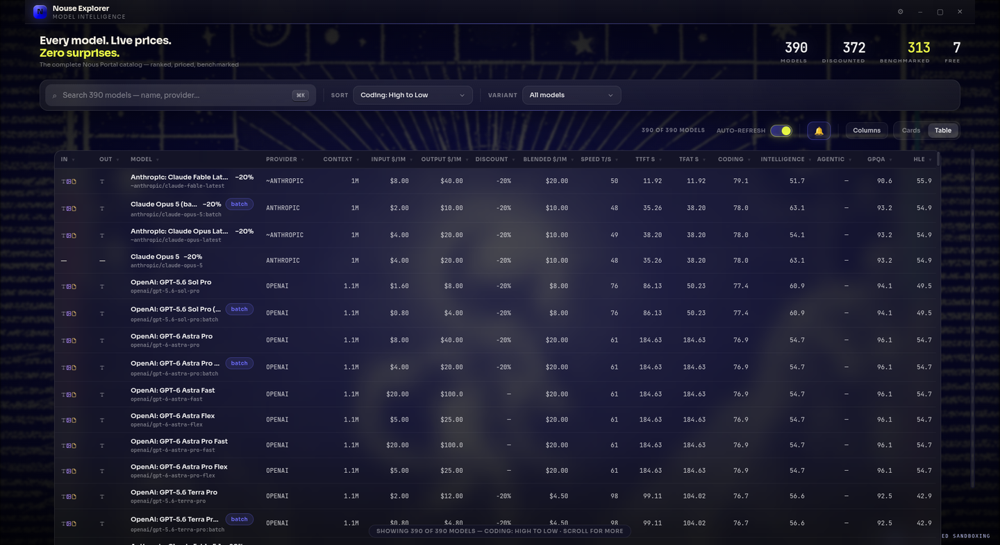
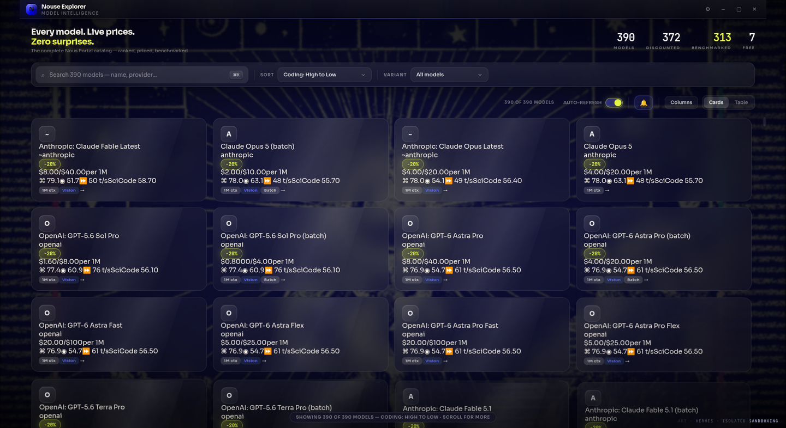
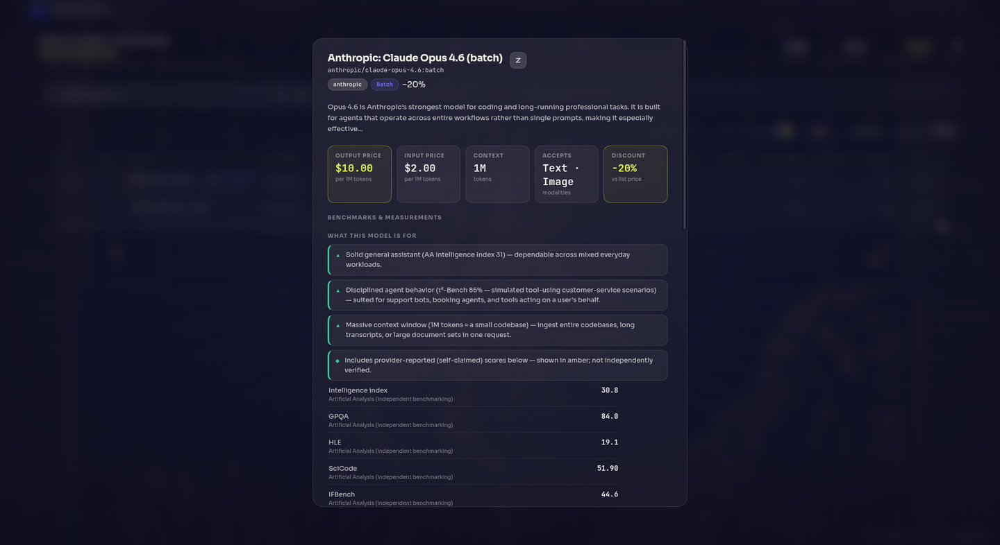
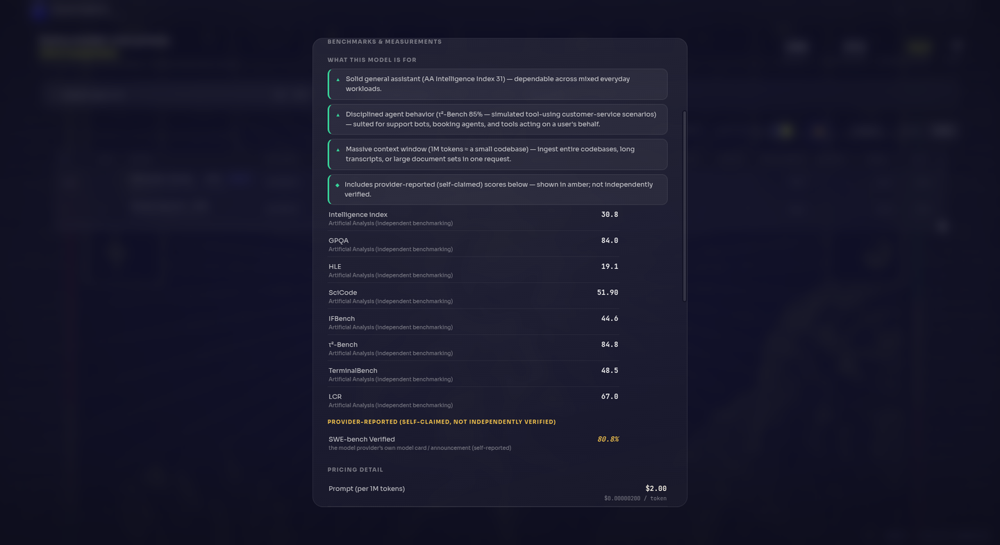
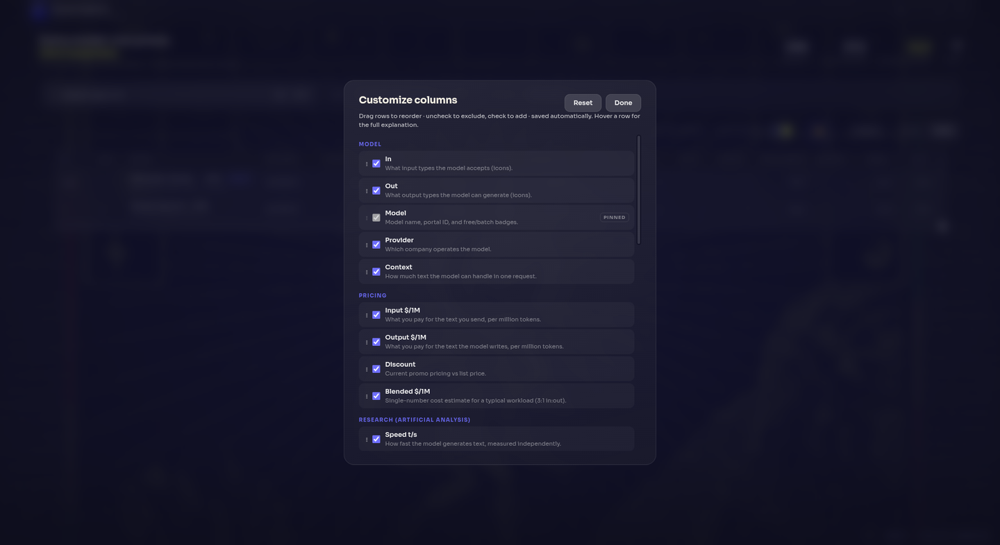
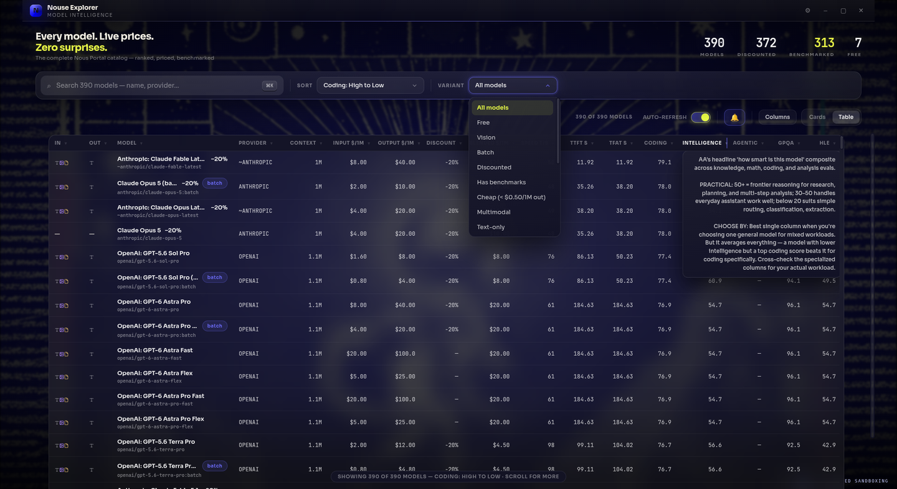
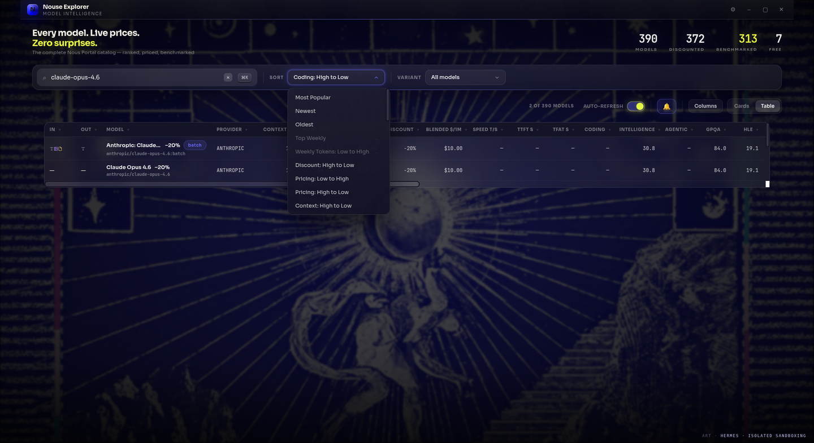
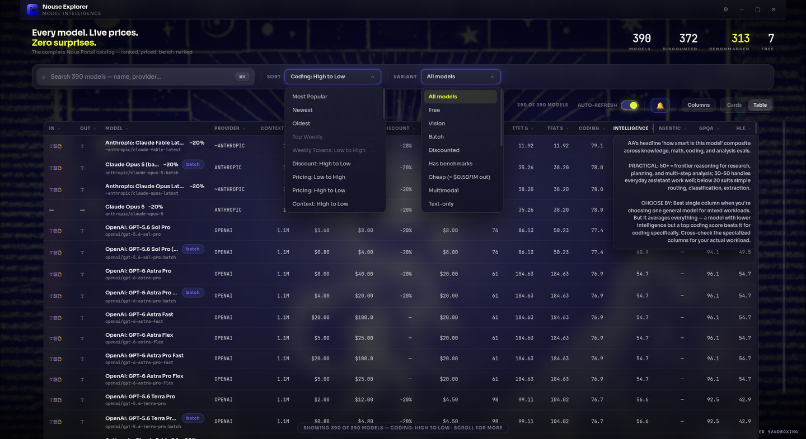
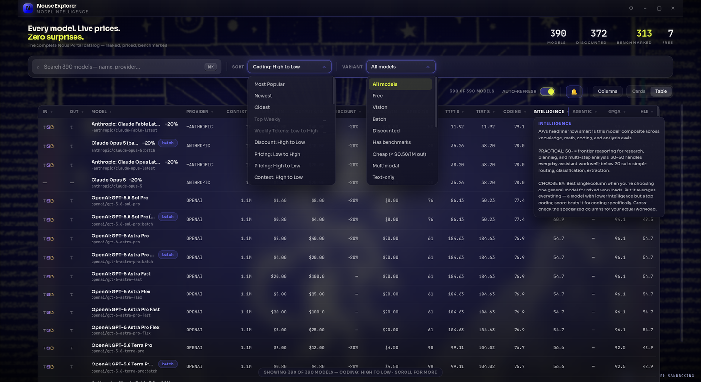

# Nouse Explorer

**A desktop explorer for the full Nous Portal model catalog — built so you can choose a model based on knowledge and reasoning, not a routing service's hidden verdict.**

Nouse Explorer pulls the complete live catalog (~390 models), enriches it with independent benchmark data, and presents every number with its meaning: what each metric measures, where it came from, and what it predicts for your workload. No black-box rankings, no hidden scoring — every claim carries its evidence.



### Every model. Every metric. Every reason.

| | |
|---|---|
|  |  |
| *Card view — glass cards over the etching* | *Model detail — key stats up top, capability synthesis* |
|  |  |
| *Benchmarks with per-value source attribution* | *Column Manager — drag to reorder, toggle to add/exclude* |
|  |  |
| *Variant filters incl. per-modality selectors* | *"Accepts: Image input" — the In/Out icon columns at work* |
|  |  |
| *Sort options incl. modality grouping sorts* | *Every header explains what the metric means and when to weigh it* |

## Why

Most model pickers tell you *which* model to use. Nouse Explorer tells you *why* — and teaches you enough to disagree with it.

- **Live catalog** — every model on the Nous Portal with real-time pricing, discounts, and time-based overrides
- **Independent benchmarks** — Artificial Analysis indices and eval scores, gathered and matched automatically
- **Provider-reported scores** — where AA has no data, provider-published SWE-bench / LiveCodeBench numbers are shown **in amber**, clearly marked as self-claimed, never silently blended with independent data
- **Honest gaps** — a dash means nobody has data; **N/A** means the metric doesn't apply (embedding models can't code). No interpolation, no synthetic numbers, no surprises
- **Provenance on every value** — hover any cell to see its source: independent benchmarking, an aggregator composite, or the provider's own model card

## Features

### Table

- **Modality icons** (`In` / `Out`) — tiny color-coded glyphs showing text / image / video / audio / file support at a glance
- **27 data columns** — pricing (input, output, blended), context, AA indices (Intelligence, Coding, Math, Agentic), eval scores (GPQA, HLE, MMLU-Pro, LiveCodeBench, SciCode, AIME, MATH-500, IFBench, τ²-Bench, TerminalBench, LCR), speed/latency (tok/s, TTFT, TFAT), and Hugging Face community stats
- **Decision-guidance tooltips** — every column header explains what the metric measures, practical score thresholds, and *when to weigh it for your workload* (and when to ignore it)
- **Resizable, reorderable, persistent** — drag column edges to resize, double-click to reset, drag rows in the Column Manager to reorder, check/uncheck to add/exclude. All saved across restarts
- **Sort + filter by modality** — "Audio input models first", "Accepts: Image input", "Outputs: Image", and more, combinable with every metric sort

### Model detail card

- **Key stats band** — output price, input price, context, modalities, and discount, up top where decisions start
- **"What this model is for"** — capability statements inferred from benchmark percentile bands, with the benchmark name, score, and what it measures inline. Example:

  > ▲ Strong at graduate-level science (GPQA 93% — questions PhD experts designed so skilled non-experts score ~34%) — trustworthy for research assistants and technical Q&A
  >
  > ▼ Slow first response (54.6s TTFT) — users will wait; fine for async work, poor for live chat.

- **Benchmarks with sources** — each value cites where it came from: *Artificial Analysis (independent benchmarking)*, *OpenRouter (AA composite)*, or *the provider's own model card (self-reported)*
- **Full pricing detail** — effective prices, original prices, cache read/write tiers, and time-based overrides

### Research engine

A background engine (runs in the Electron main process, SQLite-backed) keeps the data fresh:

1. **Provider tier** — Hugging Face stats from each model's own API
2. **Artificial Analysis tier** — the full AA data API: composite indices plus 13+ eval scores, matched to portal models via slug/name/token-order matching
3. **OpenRouter tier** — the same AA composites for models the AA data API doesn't cover
4. **Provider-reported tier** — guardrailed scrape of Hugging Face model cards for provider-published scores, stored with source URLs and never mixed into independent data

## Getting started

### Prerequisites

- Node 18+ and npm
- Linux (AppImage/deb builds; macOS/Windows untested but should work via electron-builder)

### Install & run (development)

```bash
git clone https://github.com/cse-creative-systems-engineering/nouse-explorer.git
cd nouse-explorer
npm install

npm run dev              # vite dev server (renderer, hot reload)
npm run electron:build   # compile the electron main/preload
./node_modules/.bin/electron dist-electron/electron/main.js
```

### Optional API keys

The app works without any keys — the catalog and AA/OpenRouter composites are fetched anonymously. For higher rate limits and to enable the distillation tier, set keys in **Settings** (gear icon):

- **Nous Portal API key** — enables the research distiller (cited qualitative model profiles)
- **Artificial Analysis API key** — authenticated AA data access
- **OpenRouter API key** — authenticated OpenRouter catalog access

Keys are stored locally in the app's SQLite settings database and never leave your machine.

### Build for release

```bash
npm run dist             # AppImage + deb into ./release
```

## The data, honestly

This app's core commitment is that numbers mean things:

| You see | It means |
|---|---|
| A number | Independently benchmarked (AA) or an AA composite via OpenRouter — source shown in the tooltip |
| Amber italic number | Provider-reported (self-claimed); real, but not independently verified and on its own scale |
| `—` | No data exists from any source we query |
| `N/A` | The metric cannot apply to this model (e.g. coding scores for embedding models) |

Coverage is what it is: roughly 65% of catalog models have an AA coding index, 80% have intelligence scores. The gaps are real — many models simply haven't been independently benchmarked — and this app would rather show you the gap than invent a number to fill it.

## Tech stack

- **Electron 33** (frameless custom chrome) + **React 18** + **Vite** + **TypeScript** + **nanostores**
- **SQLite** (node:sqlite) for the research store; **better three-tier fetch pipeline** with in-memory TTL caches
- No runtime telemetry, no accounts, no cloud dependency beyond the data APIs themselves

## Project structure

```
electron/            main process: window, IPC, research engine
  research/          fetchers, queue, SQLite store, alerts, distiller
src/
  components/        React UI (table, cards, column manager, settings…)
  lib/
    columns.ts       single source of truth for every column: label,
                     tooltip, format, value getter
    filterbar.ts     sort/variant/filter logic
    pricing.ts       price resolution, discount math, formatting
  styles/            the glass theme
```

## License

MIT — see [LICENSE](LICENSE).

## Acknowledgments

- [Nous Research](https://nousresearch.com) for the Portal and its public catalog API
- [Artificial Analysis](https://artificialanalysis.ai) for independent model benchmarking
- [OpenRouter](https://openrouter.ai) for wide model coverage
- All the model providers who publish benchmark scores
